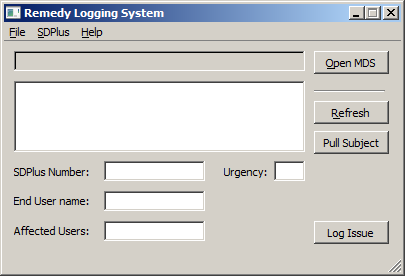
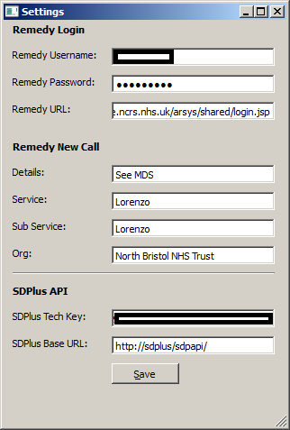
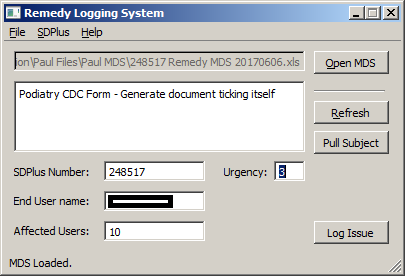

# Remedy Call Logging
A call logging GUI application which takes a Minimum DataSet file (.xls), traverses it, displays information then using automatically fills out a browser form for submission.

This is a GUI application designed for CSC's call logging system "Remedy". This is a helper tool for employees of North Bristol Trust's IT department to log calls to their supplier ("CSC") easier. I have included a menu which calls our own helpdesk system "ManageEngine" (or "SDPlus") to create and update calls on the fly from the application utilising the ManageEngine Rest API. This program reads in a CSC MDS.xls, loads the data into the program, then takes over a new IE instance to log the call into Remedy for you.

## Prerequisites
Install ["Visual C++ Redistributable for Visual Studio 2015 x86.exe"](https://www.microsoft.com/en-gb/download/details.aspx?id=48145) (on 32-bit, or x64 on 64-bit) which allows Python 3.5 dlls to work.

Setup your IE settings first: Tools, Options, Security: (This allows the Selenium to properly control the pop ups in IE)
* Internet, Uncheck "Enable Protected Mode"
* Local intranet, Uncheck "Enable Protected Mode"
* Trusted sites, Uncheck "Enable Protected Mode"
* Restricted sites, Uncheck "Enable Protected Mode"
* Close IE, Reopen and dismiss any warning message

## Run
Make a folder in "C:\Program Files\Remedy Logging System" (or another location of you choice) and put all the following files in there:
* [settings.cfg](dist/settings.cfg)
* [IEDriverServer.exe](dist/IEDriverServer.exe)
* [Remedy.exe](dist/Remedy.exe)

and run `Remedy.exe` to start.

To run code via python:
```python
python remedy.py
```

and to freeze the code with pyinstaller:
```python
pyinstaller remedy.spec
```

## Screenshots
Main Screen:



Configuration screen:



Example use:



## Notes
In File, Settings, the sdplus_api_technician_key can be obtained via the [SDPlus](https://www.manageengine.com/products/service-desk/) section:
* Admin, Assignees, Edit Assignee (other than yourself), Generate API Key.

Written by:

Simon Crouch, late 2016 in Python 3.5, with Selenium Module and SDPlus XML API